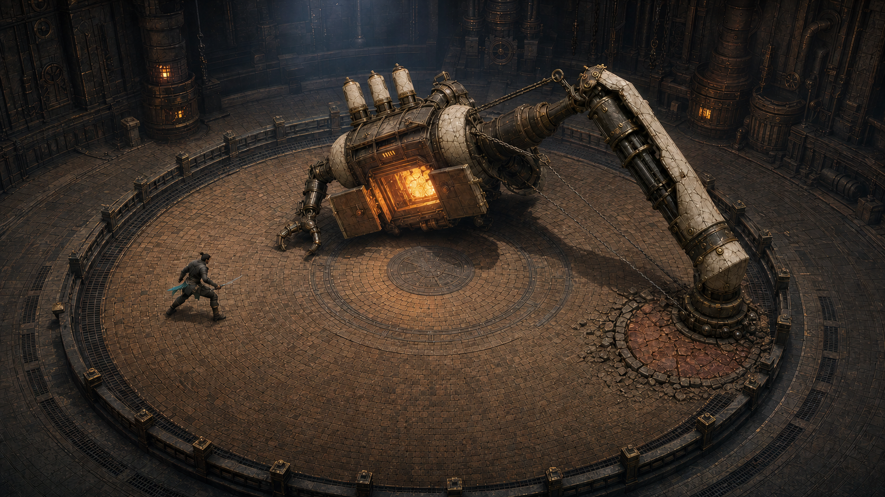

# Mirror Me AI — 완전 3D 방향 잠금

## 한 문장

**Kiln Reliquary — The Off-Balance Furnace:** 플레이어의 세 번의 발놀림을 도편에 구운 비대칭 소성 기계가 빈곳을 내려쳐, 자기 무게에 무너지며 화구를 여는 고정 쿼터뷰 3D 보스전.

이 이미지는 런타임 배경이 아니라 카메라, 실루엣, 재질과 `OUTSMART` 자세의 목표다. 런타임은 Blender에서 설계한 low-poly GLB와 실제 조명으로 구성하며 이미지의 임의 장식은 복제하지 않는다.

## 이전 화면에서 버릴 것

- Canvas 선·면으로 그린 가짜 입체와 단순 도형 조립
- 게임을 감싸는 둥근 사각형 프레임과 중앙 카드형 시작 패널
- 보스보다 먼저 보이는 텍스트, 테두리, 상태 배너
- 같은 굵기의 윤곽선, 균일한 bevel, 재질 구분 없는 갈색 면

## 세 장면

- **첫 10초:** 검이 닫힌 도자 장갑에 튕긴 뒤 파일드라이버가 바닥을 압인하고, 플레이어의 첫 회피 종착점에서 튄 청록 유약이 보스 등 첫 도편으로 굳는다.
- **AI가 학습한 순간:** 세 번째 도편이 꽂혀 같은 절삭면으로 정렬되고 철 케이블과 보스 몸 전체가 한쪽 산화철 표적에 고정되어, 글 없이도 `LOCK`이 보인다.
- **즉시 재도전:** 쓰러진 플레이어·마지막 발자국·맞은 표적·세 도편을 같은 카메라에 남긴 채, 한 입력으로 도편이 깨지고 즉시 전투 자세로 돌아간다.

## 장면의 다섯 가지 진실

1. 실제 플레이어 좌표, 3D 캐릭터의 발, 작은 청록 접지점은 항상 같은 곳이다.
2. 기억은 보스 등 슬롯에 꽂힌 **정확히 세 장**의 방향 절삭 도편이다.
3. 예측은 LOCK 순간부터 움직이지 않는 바닥 표적·강선·드라이버 축이다.
4. 헛공격은 빈 표적에 박힌 팔, 차체 과회전, 바닥을 긁는 지지 집게로 보인다.
5. 열린 화구는 기회일 뿐 피해가 아니다. 검이 화구에 닿는 동작에서만 HP가 줄어든다.

## 카메라와 공간

- 고정 35도 쿼터뷰, 32–36도 FOV, 원형 전장 가장자리 밖으로 최소 8% 여백을 둔다.
- 카메라 회전·줌·피사계 심도는 없다. 충격은 최대 8px 화면공간 병진 뒤 원위치한다.
- 2D 코어 `(x, y)`를 3D `(x, z)`로 일대일 매핑한다. 높이와 파편은 판정이 아니다.
- 전장은 UI 받침대가 아니라 난간·화구·배기구·그을음이 있는 실제 소성 시설이다.

## 모델과 재질

- 보스: 낮은 가마 몸통 + 한쪽 초대형 파일드라이버 + 반대쪽 작은 지지 집게의 비대칭 실루엣.
- 플레이어: 보스의 약 1/5 크기, 짧은 검과 청록 유약 장갑만으로 식별되는 낮은 결투 자세.
- 재질: 무광 그을린 주철, 갈라진 상아 도자, 기름먹은 캔버스, 노후 황동, 내화벽돌.
- 조명: 차가운 천창광 하나와 열린 화구의 짧은 국소광. 자홍 네온·홀로그램·격자는 없다.
- 위험: 발광 UI가 아니라 산화철 판과 열변색, 바닥 홈으로 표시하되 어떤 그림자에도 가리지 않는다.

## 모션 계약

- 모든 공격은 `예비동작 → 정지 → 접촉 → 연쇄 반동`의 네 박자를 가진다.
- LOCK 이후 표적, 강선, 드라이버 헤드는 플레이어를 다시 추적하지 않는다.
- 파일드라이버 헛공격은 약 50ms 접촉 홀드 뒤 차체·추·케이블·셔터 순서로 전달된다.
- 대시는 입력 프레임에 발밑 접지점과 메시 루트가 함께 착지하며, 공중 분신 대신 110ms 이하의 바닥 유약 흔적만 남긴다.
- 코어 타격은 약 65ms에 검과 화구가 접촉하고, 그 프레임에만 HP·섬광·카메라 반동이 반응한다.
- 플레이어 피격은 루트 넉백이나 조작 불능을 추가하지 않고 상체 반동과 보호막 파편으로만 보인다.

## 구현 범위

- Three.js `WebGLRenderer` + `GLTFLoader`, 고정 카메라, 한 원형 전장 GLB, 플레이어 GLB 한 명, 분절형 보스 GLB 한 기
- 보스 named node: `driver`, `brace`, `shutter_l`, `shutter_r`, `core`, `memory_01..03`; 상태에 따라 rigid transform과 최소 애니메이션을 재생한다.
- 플레이어는 `idle/run/dash/attack/hit`, 보스는 `idle/remember/lock/strike/stagger/core-open`의 최소 클립만 가진다.
- 절차형 메시는 위험 구역·LOCK 표적·대시 흔적에만 사용한다. 캐릭터와 보스 외형의 원뿔·원통 조립은 금지한다.
- 3D 판정·물리 엔진·자유 카메라·점프·새 공격·공간 음향 제외
- 로컬로 고정한 Three.js와 정적 빌드만 사용하며 런타임 CDN 요청 없음
- Blender 원본·headless export 스크립트·GLB를 함께 관리하고 첫 자산 총량은 8MB 이하, Draco/KTX2는 사용하지 않는다.
- 모바일은 DPR 상한, 제한된 동적 그림자와 파티클 수로 같은 구도를 보존

## PASS

- UI와 소리를 꺼도 `기억 → LOCK → 반대 회피 → 헛공격 → 코어 노출 → 직접 타격`을 설명할 수 있다.
- 320×180에서 플레이어, 고정 표적, 파일드라이버와 열린 화구를 동시에 구분한다.
- 메시 발과 실제 판정점의 화면 오차가 1px 이하이며 LOCK 뒤 표적 좌표 변화가 없다.
- OUTSMART에서 보스 HP는 줄지 않고, 검·화구 접촉과 HP 감소가 ±1프레임 안에 일치한다.
- `src/game-core.mjs`와 기존 판정 테스트를 바꾸지 않고 모두 통과한다.
