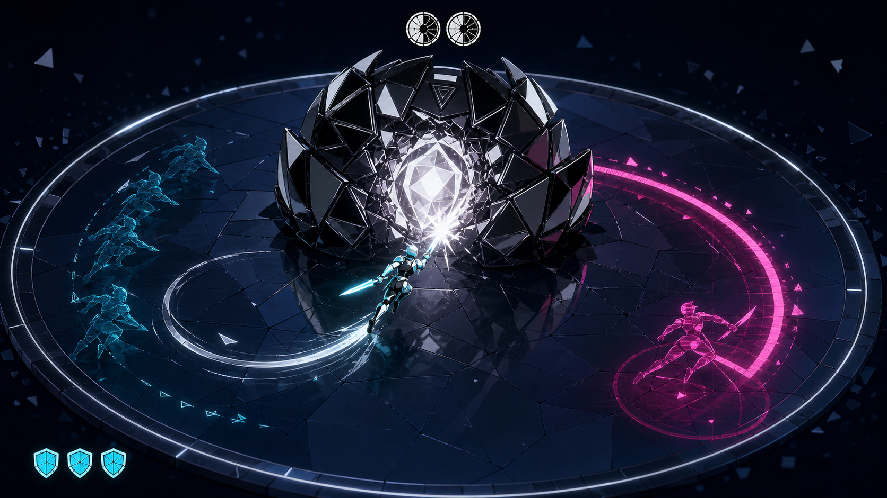
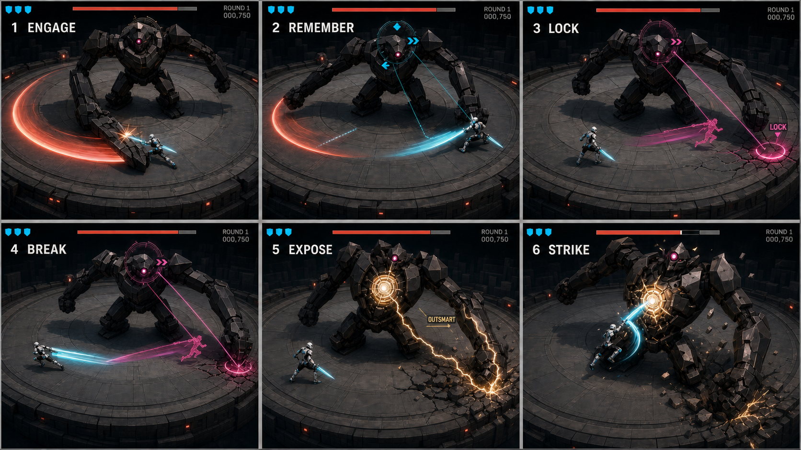

# Mirror Me AI — 2.5D 비주얼 방향

## 1. 확정 방향

Mirror Me AI의 기준 화면은 **고정 쿼터뷰 2.5D 액션 보스전**이다.

- 실제 플레이 감각은 자유 평면 이동, 근접 공격, 방향 대시다.
- 캐릭터와 보스는 입체적으로 보이지만 모든 전투 정보는 바닥에서 읽힌다.
- 카메라는 회전하거나 어깨 뒤로 내려가지 않는다.
- 2D 아트로 제작하더라도 동일한 쿼터뷰 구도와 전투 평면을 유지한다.
- 선택문, 카드, 추상적인 방향 버튼이 아니라 실제 캐릭터와 보스의 몸짓으로 규칙을 보여 준다.

## 2. 기준 플레이 화면

이 이미지는 최종 아트가 아니라 한 화면의 우선순위를 합의하기 위한 기준이다.

반드시 유지할 요소:

- 원형 전장 전체와 가장자리가 한 화면에 보인다.
- 거대한 검은 보스가 화면 위쪽 중앙을 차지한다.
- 실제 플레이어는 청록·백색 실체로 보인다.
- AI가 예상한 플레이어는 자홍색 와이어 잔상이다.
- 자홍 예측 경로와 실제 백색·청록 경로가 명확히 갈라진다.
- 열린 코어와 플레이어 무기 접촉이 같은 화면에 보인다.
- 보스 체력과 플레이어 보호막 외의 HUD는 최소화한다.

이 이미지에서 수정해 해석할 요소:

- 청록 과거 잔상은 여러 명의 플레이어처럼 길게 남기지 않는다. 실제 게임에서는 현재 흔적 하나가 기억 조각으로 접힌다.
- 보스 기억은 장식 파편이 아니라 정확히 세 칸의 방향 조각으로 읽혀야 한다.
- 흰 코어 섬광이 플레이어 실루엣을 삼키지 않도록 실제 타격 순간의 광량을 낮춘다.

`2_5d-gameplay-keyframe.png`는 과거 흔적, 예측, 코어 노출, 직접 타격을 한 장에 합친 합성 콘셉트이며 카메라, HUD, 기억 슬롯 수와 판정 시점의 기준이 아니다. 상단 두 원형 문양은 기억이나 보호막이 아니며 실제 화면에서는 사용하지 않는다.

## 3. 첫 10초 스토리보드

| 패널 | 장면 | 화면에서 읽혀야 하는 인과 |
| --- | --- | --- |
| 1. ENGAGE | 플레이어가 보스 장갑을 직접 공격하고 보스가 주황 탐색 베기를 준비한다. | 직접 싸우지만 닫힌 장갑에는 피해가 없다. |
| 2. REMEMBER | 청록 회피 종료점이 보스의 세 기억 조각으로 접힌다. | AI가 입력 키가 아니라 탐색 공격 종료 순간의 회피 측면을 기억한다. |
| 3. LOCK | 기억 조각이 자홍 미래 잔상, 착지 구역, 공격 레일로 변한다. | AI가 예상한 다음 측면 구역을 공개하고 고정한다. |
| 4. BREAK | 실제 플레이어가 반대 측면으로 빠져 두 경로가 V자로 갈라진다. WASD와 대시는 같은 종료 위치라면 같은 결과다. | `LOCK` 뒤에는 공격이 실제 플레이어를 따라오지 않는다. |
| 5. EXPOSE | 보스가 빈 잔상을 내려쳐 과회전하고 흉부 코어가 열린다. | 오판은 피해가 아니라 공격 기회를 만든다. |
| 6. STRIKE | 플레이어가 직접 코어를 벤다. | 무기 접촉 순간에만 보스 체력이 줄어든다. |

스토리보드는 장면 순서와 화면 우선순위의 기준이다. 다음 세부 표현은 그대로 복제하지 않는다.

- 모든 패널의 실제 게임 카메라는 같은 거리와 각도를 유지한다.
- 큰 원형 대시 버튼은 사용하지 않는다. 대시 상태는 필요할 때 플레이어 발밑의 얇은 링으로만 표시한다.
- 기억 링에는 정확히 세 조각만 사용하며 `>>` 같은 HUD 화살표처럼 보이지 않게 보스 장갑에 물리적으로 끼운다.
- 패널 1~5의 보스 체력은 그대로이고 패널 6의 검격 접촉에서만 감소한다.
- 패널 5의 `OUTSMART` 직후에는 코어만 열리고 자동 피해 숫자나 체력 감소가 나오지 않는다.

6패널 이미지의 연속형 체력바 길이 변화와 패널 6의 확대는 생성 오류다. 실제 카메라는 전 패널에서 동일하고, 보스 체력은 여섯 칸이며 패널 1~5에서는 변하지 않고 패널 6의 무기 접촉 때만 감소한다.

이미지의 휘어진 청록 흔적은 생성 오류다. 실제 대시는 이동 방향과 일치하는 짧은 평행 직선, 검격은 무기 접촉점의 짧은 초승달이며, 패널 5의 금빛 균열은 피해가 아니라 코어 잠금 해제를 뜻한다.

## 4. 카메라와 크기 관계

### 카메라

- 약 35도 내려다보는 고정 쿼터뷰
- 원형 전장이 타원으로 읽히되 뒤쪽 가장자리까지 보이는 거리
- 전투 중 회전, 피치 변경, 수동 확대 없음
- `LOCK`은 약한 정적과 미세한 화면 압축만 사용
- 코어 타격은 줌 대신 짧은 히트스톱, 화면 흔들림, 접촉 섬광 사용

### 크기

- 보스 키는 플레이어의 약 다섯 배
- 보스는 화면 상단 중앙 1/3을 점유
- 플레이어는 하단과 측면을 자유롭게 돌 수 있는 여백을 확보
- 보스의 팔과 장갑이 플레이어 또는 바닥 예고를 가리면 반투명하게 만들기보다 포즈를 바꾼다

## 5. 색과 형태의 문법

색만으로 구분하지 않고 선과 재질을 함께 바꾼다.

| 의미 | 색 | 형태와 재질 |
| --- | --- | --- |
| 일반 보스 위험 | 주황·적색 | 바닥의 넓은 부채꼴 또는 직선 도형 |
| 실제 플레이어 | 청록·백색 | 불투명 실체와 선명한 바닥 그림자 |
| 현재 대시 | 청록 | 짧고 평행한 직선 잔상 |
| 과거 대시 기억 | 청록 | 점선 흔적이 보스의 유리·금속 조각으로 접힘 |
| AI 예측 | 자홍 | 실선 경로, 와이어 플레이어 잔상, 채운 착지 구역 |
| LOCK | 자홍·백색 | 움직임이 멈춘 레일, 고정된 보스 눈, 금속성 결합 |
| AI 오판 | 백금·금색 | 빗나간 팔에서 코어까지 이어지는 물리적 균열 |
| 직접 검격 | 청록·백색 | 짧은 초승달과 무기·코어 접촉 섬광 |

## 6. 보스와 플레이어 디자인 원칙

### AI 보스

- 검은 다면체 장갑과 중앙 센서 눈으로 구성한다.
- 기억 조각은 머리 또는 흉부 주위의 정확한 세 슬롯에 꽂힌다.
- 예측한 측면으로 팔과 장갑의 무게가 실제 이동해 과신이 몸짓으로 보인다.
- 오판하면 과회전한 팔의 균열이 흉부 셔터를 열어 코어 노출의 원인이 된다.
- 코어는 평소 보이지 않으며 열린 동안만 백금·금색으로 빛난다.

### 플레이어

- 작은 체형, 밝은 청록 포인트, 짧은 에너지 검으로 보스와 즉시 구분한다.
- 대시는 직선 잔상, 공격은 초승달 검격으로 형태를 분리한다.
- 복잡한 장비와 망토는 바닥 그림자와 대시 방향을 가리므로 제외한다.
- 공격 방향은 한 명뿐인 보스를 향하고, 자세는 이동 방향을 읽는 데 방해되지 않아야 한다.

## 7. 최소 HUD

- 좌측 상단: 플레이어 보호막 세 칸
- 상단 중앙: 여섯 칸으로 읽히는 보스 코어 체력
- 우측 상단: 현재 라운드와 점수
- 보스 본체: 세 칸 기억 링
- 전장 안: 미래 잔상, 착지 구역, 공격 레일

`OUTSMART`, `READ`, `LOCK`은 장면을 설명하는 문장이 아니라 이미 보인 결과에 찍히는 짧은 도장이다. 화면 중앙에 긴 설명문을 띄우지 않는다.

## 8. 2D 아트 대안

2D는 기능 축소판이 아니라 같은 플레이를 표현하는 제작 대안이다.

- 배경은 한 장의 쿼터뷰 원형 전장과 깊이 레이어로 구성한다.
- 보스와 플레이어는 방향 수를 제한한 스프라이트 또는 컷아웃 애니메이션으로 표현할 수 있다.
- 바닥 그림자, 공격 도형, 대시 잔상, 미래 잔상은 2.5D 기준과 같은 위치에 둔다.
- 카메라, 이동 평면, AI 표본, 코어 노출, 직접 타격 규칙은 바꾸지 않는다.

2D로 바꿨을 때 보스의 과회전과 코어 셔터가 읽히지 않는다면 단순한 프레임 수보다 큰 실루엣 변화와 파츠 분리를 우선한다.

## 9. 비주얼 PASS 조건

- 정지 화면 한 장만 보고도 플레이어, 실제 경로, AI 예측 경로, 열린 코어를 구분할 수 있다.
- 여섯 패널을 글 없이 보아도 `공격 → 기억 → 예측 → 반대 대시 → 코어 노출 → 직접 타격` 순서를 설명할 수 있다.
- 보스 체력 감소가 패널 6의 무기 접촉과 연결된다.
- 카메라가 고정되어 모든 패널에서 같은 조작 축을 상상할 수 있다.
- 높이, 팔, 파편, HUD가 바닥 공격과 착지 구역을 가리지 않는다.
- 문 선택 게임, 카드 게임, 자동 전투처럼 보이지 않는다.

하나라도 실패하면 최종 아트를 늘리지 않고 해당 키프레임의 실루엣과 정보 우선순위를 먼저 수정한다.

## 10. 생성 메모

두 이미지는 내장 이미지 생성 기능으로 만든 기획 검토용 래스터 이미지다. 최종 캐릭터 디자인이나 실제 게임 화면을 확정하는 자료가 아니며, 공통 카메라와 전투 인과를 합의하기 위한 기준으로만 사용한다.

핵심 프롬프트는 다음 요구를 사용했다.

> 고정 35도 쿼터뷰의 원형 전장, 거대한 검은 다면체 AI 보스, 작은 청록 근접 전투원, 청록 실제 대시, 자홍 미래 잔상과 고정 레일, 오판으로 열린 백금 코어, 플레이어의 직접 검격. 문, 추상 다이어그램, 자유 카메라, 자동 반사 피해, 탄막 혼잡은 제외한다.
