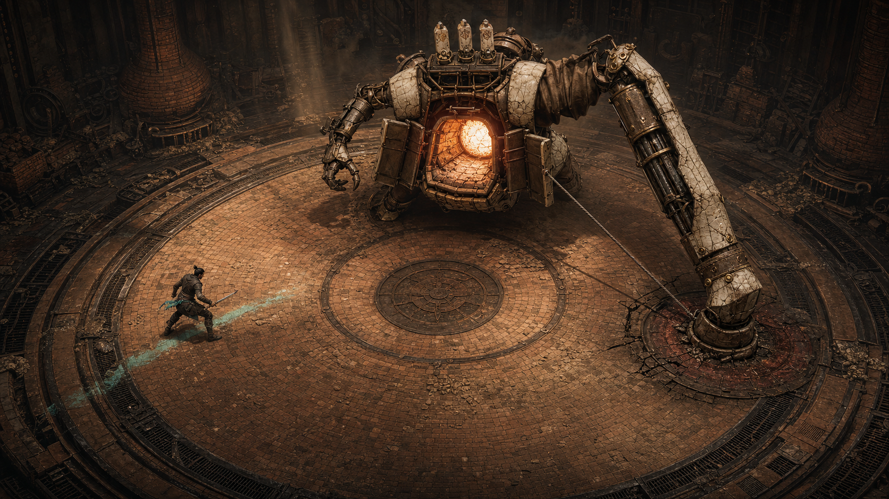

# Mirror Me AI — 비주얼 정체성 3안

> 상태: 공동 디렉터 검토용. 어느 방향도 최종 확정하지 않는다.
> 비교 장면: `LOCK`된 보스가 오른쪽의 빈 예측 지점을 강타하고, 실제 플레이어는 왼쪽 위험 구역 밖에 살아 있으며, 과회전 때문에 코어가 열리는 `OUTSMART` 순간.
> 생성 이미지는 최종 아트가 아니라 실루엣·재질·정보 우선순위를 비교하는 키프레임이다.

## 0. 현재 화면이 “AI가 만든 제네릭 네온 게임”처럼 보이는 이유

현재 빌드는 규칙 검증용 그레이박스로는 충분하지만, 다음 표현이 동시에 겹치면서 특정 세계보다 생성형 콘셉트 아트의 평균값에 가깝게 읽힌다.

- CSS와 Canvas가 어두운 남청색 바탕에 청록 `#38eff0`, 자홍 `#f044bd`, 주황 `#ff7547`을 거의 모든 의미 구분에 사용한다.
- 전장은 빛나는 원형 테두리, 스캔 라인, 균일한 격자로 구성되어 실제 장소보다 전투 시뮬레이션 UI처럼 보인다.
- 보스는 대칭 팔, 중앙 발광 눈, 검은 다면체 장갑, 중앙 코어로 구성되어 기능과 역사보다 “AI 보스”라는 추상어를 그대로 형상화한다.
- 예측은 자홍 와이어 인간, 빛나는 레일, 원형 표적처럼 홀로그램으로 표현된다. 기억도 보스 몸체의 부품이 아니라 `MEMORY` 라벨 아래 떠 있는 HUD 아이콘에 가깝다.
- 화면 상단의 세 박스, 영어 대문자 상태명, 네온 테두리가 실제 전투보다 대시보드를 먼저 보게 한다.
- 모든 것이 자체 발광하고 표면이 비슷하게 매끈해, 공격의 무게·마찰·충격이 재질 변화로 남지 않는다.

따라서 다음 단계는 색을 바꾸는 리스킨이 아니다. 아래 세 안은 공통으로 다음을 제거한다.

1. 자홍 홀로그램 인간과 빛나는 격자
2. 대칭 검은 다면체 로봇
3. 상단 HUD 박스 세 개와 전투 중 긴 설명문
4. 색만으로 구분하는 기억·예측·위험
5. 공격이 끝난 뒤 아무 흔적도 남지 않는 깨끗한 전장

### 먼저 생성된 3장에 대한 교차 판정

- `a-industrial-rite.png`: 빈 충돌점과 거대한 팔의 무게는 가장 잘 읽힌다. 그러나 금장 장식, 암부, 거대한 인간형 골렘이 익숙한 소울라이크 평균값으로 돌아갈 위험이 크다. **동작의 인과만 채택하고 장식은 채택하지 않는다.**
- `b-ink-woodblock.png`: 가장 한눈에 다른 게임처럼 보인다. 반면 단풍, 의복, 먹화 배경이 특정 문화의 표면 요소를 한꺼번에 사용해 또 다른 생성형 이미지 클리셰가 될 수 있다. **종이·잉크·인쇄 공정만 유지하고 문화 장식은 전부 다시 설계한다.**
- `c-stop-motion-mechanism.png`: 기억 부품과 큰 팔은 명확하지만 A안과 색, 재질, 보스 형태가 거의 같다. 정지 이미지에서는 스톱모션 제작법도 읽히지 않는다. **별도 미술 방향으로는 불합격이며, 밝은 대낮의 아날로그 경기장으로 재정의해야 세 번째 안이 된다.**

현재 생성 세 장만 놓고 고른다면 A를 임시 기준으로 삼고, B의 물질성을 비교 검증하며, C는 재작업한다.

## 1. 세 안이 공유하는 판정 불변 조건

- 약 35도 고정 쿼터뷰와 전체 원형 전장을 유지한다.
- 이동과 피격의 진실은 바닥점 하나와 바닥 위험 도형 하나에만 있다.
- `LOCK` 뒤 예측 표적은 움직이지 않는다.
- 보스가 빈 표적을 친 자세와 열린 코어가 한 화면에서 이어져야 한다.
- 실제 플레이어와 실제 탈출 종료점은 예측 표적과 동시에 보여야 한다.
- `OUTSMART` 순간에는 보스 체력이 줄지 않는다. 플레이어 무기는 코어와 아직 접촉하지 않는다.
- 기억은 정확히 세 칸이며, 각 칸은 색이 없어도 좌·우를 구분할 수 있는 비대칭 형태다.
- 생성 이미지에서 표현이 부족해도 이 판정 조건을 바꾸지 않는다.

---

## A안 — Kiln Reliquary / 기억을 굽는 노(爐)



### 세계관 한 문장

버려진 산업 제례장의 거대한 소성 기계가 결투자의 발놀림을 세 장의 도편에 구워 넣고, 그 기록을 맹신해 스스로의 용광로 심장을 연다.

### 세 장면에 주는 효과

1. **첫 10초 훅:** 0.2초의 검격이 닫힌 백자 장갑에 부딪힐 때 `챙`이 아니라 두꺼운 도자기와 주철이 함께 울리는 낮은 파열음이 난다. 이어 탐색 팔이 바닥의 산화철 홈을 긁으며 넓은 위험 띠를 실제로 만든다.
2. **AI가 학습한 순간:** 회피 종료점의 청록 법랑 가루가 보스로 빨려 들어가지 않는다. 바닥 홈을 따라 작은 기계 팔이 움직이고, 정확히 한 장의 도편이 `찰칵` 소리와 함께 등 위 선반에 꽂힌다. 도편의 왼쪽 또는 오른쪽 모서리가 잘려 있어 색 없이 방향이 보인다.
3. **재도전 순간:** 죽은 전장 위에 마지막 산화철 표적, 실제 발자국, 세 도편이 그대로 남는다. 화면을 가리는 결과 카드 대신 재 위에 두 경로만 짧게 밝히고, 다음 입력 한 번에 세 도편이 깨져 새 판이 열린다.

### 실루엣

- 보스는 어깨가 같은 인간형이 아니라, 낮게 웅크린 가마 몸통과 한쪽에만 달린 거대한 카운터웨이트 파일드라이버 팔을 가진다.
- 반대편 팔은 바닥을 짚는 작은 집게다. 공격 전에는 큰 팔이 뒤로 당겨지고, `LOCK`에서는 몸 전체가 한쪽으로 기울며, 빗나가면 팔이 바닥에 박혀 실루엣이 긴 대각선으로 무너진다.
- 열린 코어는 빛나는 보석이 아니라 앞문 두 장과 내부 내화벽이 벌어져 보이는 실제 화구다.
- 플레이어는 보스 높이의 약 1/5인 작은 결투자다. 짧은 칼과 한쪽 어깨의 청록 법랑 조각만 유지하고 망토·긴 머리·복잡한 장비는 제외한다.

### 재질

- 보스: 그을린 주철, 갈라진 더러운 상아색 도자 장갑, 기름 먹은 캔버스 벨로우즈, 오래된 황동 핀.
- 전장: 내화벽돌, 배수 철망, 산화철 홈, 세라믹 분진, 이전 타격의 눌린 흔적.
- 플레이어: 무광 가죽과 천, 짧은 강철 칼, 제한된 청록 법랑.

재질 반응이 이 방향의 애니메이션이다. 도자기는 금이 가고, 철은 휘며, 재는 밀리고, 벨로우즈는 눌린다. 발광 파티클이 이를 대신하면 안 된다.

### 팔레트

| 용도 | 색 |
| --- | --- |
| 세계 바탕 | 숯검정, 연기 회색, 더러운 상아 |
| 보스 작동부 | 낡은 황동, 기름 갈색 |
| 일반 위험·예측 표적 | 산화철 적색, 가열된 어두운 주황 |
| 실제 플레이어·실제 종료 흔적 | 산화된 청록 법랑 |
| 열린 코어 | 백색에 가까운 노열과 소량의 황금 주황 |

청록은 플레이어와 실제 행동에만 쓴다. 자홍은 완전히 제거한다.

### 전장

- 원형 전장은 거대한 가마의 회전 소성판이다. 바깥 원은 화려한 SF 링이 아니라 배수 철망과 내화벽돌 턱이다.
- 동심원은 장식 문양이 아니라 회전판의 연결부와 오래된 타격 원이다.
- 보스 뒤의 수직 공간에는 벨로우즈와 연통이 보이지만, 전투 평면을 가리는 전경 장식은 두지 않는다.
- 이전 빗나감은 벽돌 파임과 재의 방향으로 한두 개만 남기며, 새 판에서는 서서히 정리한다.

### 보스와 플레이어

- 보스의 시선은 발광 눈이 아니라 조준용 작은 황동 셔터다. `LOCK` 순간 셔터가 닫히고 큰 팔의 래칫이 물려 더 이상 추적하지 않는다.
- 큰 팔의 케이블이 최대 신장되면 흉부 문과 연결된 링크를 잡아당긴다. 그래서 빗나감이 코어 개방의 물리적 원인이 된다.
- 플레이어 공격은 에너지 초승달 대신 칼날 접촉점의 짧은 백색 마찰 섬광과 도자 파편 두세 개로 표현한다.
- 대시는 두 줄의 빛이 아니라 재가 얇게 갈린 짧은 직선과 청록 법랑 가루 한 줄이다.

### 위험 예고

- 탐색 공격 전 0.55초 동안 바닥의 산화철 셔터 두 줄이 양끝에서 중앙으로 닫힌다. 판정 순간 두 금속 선이 맞부딪히는 소리와 일치한다.
- `LOCK` 표적은 산화철 원판과 보스 조준 셔터를 잇는 팽팽한 강선이다. 표적의 외곽 철편이 모두 올라오면 고정 완료다.
- 공격 직전에는 발광을 키우지 않고 큰 팔의 래칫 간격이 빨라지고 바닥 원판이 떨린다.
- 공격 후에는 박힌 팔 주변의 위험 홈이 검게 식어 “이미 끝난 공격”임을 보여 준다.

### 기억의 물리 표현

- 등 위에 정확히 세 칸의 도편 선반이 있다.
- 왼쪽 회피는 왼쪽 위 모서리가 잘린 도편, 오른쪽 회피는 오른쪽 위 모서리가 잘린 도편이다.
- 세 표본이 결합되면 다수 방향 도편 둘이 같은 쪽 래칫을 밀고, 조준 강선이 그쪽 원판으로 이동한다.
- 가장자리 강제 회피는 도편이 선반 앞까지 왔다가 균열 나며 떨어져 “회피는 성공했지만 학습하지 않음”을 보여 준다.

### HUD 제거 원칙

- 전투 중 세 개의 상단 박스와 `MEMORY` 라벨을 제거한다.
- 플레이어 보호막은 좌측 상단에 패널 없이 작은 도자 보호패 세 장만 둔다.
- 보스 체력 여섯 칸은 코어 문 둘레의 여섯 잠금 이빨과 같은 형태를 상단 중앙에 얇게 반복한다. 텍스트 라벨은 없다.
- 점수, 생존 시간, `OUTSMART` 횟수는 게임 오버와 라운드 전환에서만 보여 준다.
- `LOCK`, `OUTSMART`, `READ`는 최대 0.45초 동안 찍히는 작은 활자 도장으로만 허용한다. 이미 장면이 설명한 뒤 확인하는 역할이다.

### 금지 요소

- 고딕 성당, 룬, 금장 문양, 해골, 종교 아이콘처럼 세계를 익숙한 다크 판타지로 돌리는 장식
- 모든 균열에서 주황빛이 새는 표현
- 대칭 어깨와 양팔, 중앙 단안의 전형적인 골렘 실루엣
- 자홍 예측, 홀로그램 인간, 레이저, 와이어프레임
- 화면을 덮는 재·불꽃·렌즈 플레어
- 코어를 보석이나 에너지 구체로 표현하는 것

### 생성 이미지 검토

- **성공:** 한쪽 팔의 과신, 빈 오른쪽 충돌점, 왼쪽 실제 플레이어, 세 도편, 열린 화구가 한 장에서 가장 강하게 연결된다. 세 안 중 타격의 무게와 코어 개방 원인이 가장 명확하다.
- **보완:** 보스가 여전히 넓은 어깨를 가진 인간형으로 보일 여지가 있다. 실제 제작에서는 몸통을 더 낮추고 작은 팔을 바닥 지지대로 바꿔 대칭 인간형을 끊어야 한다. 플레이어의 청록 흔적도 페인트보다 분진 마찰에 가깝게 줄인다.

### 이미지 생성용 완성 프롬프트

```text
Use case: stylized-concept
Asset type: game visual-direction concept keyframe
Primary request: Create a polished wide 16:9 gameplay keyframe for a short browser action boss fight at the exact OUTSMART moment. The AI boss has committed to a wrong prediction on the right side, its enormous pile-driver arm has just smashed an empty fixed target plate, the real player is safely outside the hazard on the opposite left side, and the boss's chest core has physically opened. No damage is happening yet.
Scene/backdrop: a sunken circular kiln platform inside an abandoned industrial firing hall, seen from a fixed 35-degree elevated quarter view. Entire oval arena rim, giant boss, small player, empty struck target, and open core all visible at once. Firebrick, soot, iron drainage channels, old impact scars, drifting ceramic dust.
Subject: a five-times-player-size asymmetrical “Kiln Reliquary” boss: hunched furnace torso, one immense counterweighted pile-driver arm embedded in the empty right-side floor plate, one smaller stabilizing arm, blackened iron frame, cracked ivory porcelain armor, canvas bellows, brass pins. Its overcommitted weight visibly twists the torso and mechanically forces the chest shutters open, revealing a contained white-hot kiln core. Exactly three small ceramic memory tally plates are slotted into a rack on its upper spine. A compact human duelist stands alive on the left, low ready stance, short physical blade, worn dark cloth and leather, one restrained oxidized-turquoise enamel accent.
Visual causality: the wrong predicted landing point is a fixed rust-red iron floor plate connected to the boss's sight by a taut mechanical targeting cable; it is cracked by the missed blow and clearly empty. The real escape route is only a short dusty skid and one pale turquoise enamel scuff ending under the real player's feet. The danger footprint is a scorched iron inlay around the embedded fist, now visibly spent. The core opens because linkages from the overextended arm pull the chest shutters apart.
Style/medium: authored premium game concept art with practical mechanical design, painterly 3D realism, restrained surfaces, purposeful wear, believable mass and animation pose; distinctive indie action game, not glossy sci-fi.
Composition/framing: fixed gameplay camera, wide shot, boss top-center, wrong impact right, real player left, strong triangular action read. Keep the floor collision plane unobstructed.
Lighting/mood: directional furnace light and dusty warm overhead shafts; mostly matte darkness with warm reflected heat, no self-lit rainbow glow.
Color palette: charcoal black, smoke gray, dirty ivory porcelain, kiln orange, oxidized iron red, aged brass; oxidized turquoise reserved only for the real player and the final escape scuff.
Materials/textures: cracked porcelain, soot-caked iron, firebrick, canvas bellows, grease, ceramic dust, chipped enamel.
Constraints: no HUD panels, no floating labels, no text, no logos, no watermark; no doors, no cards, no turn-based presentation; no automatic damage effects; open core but player weapon is not touching it; all gameplay truth readable from the boss pose and floor; exactly one real player; exactly three physical memory plates.
Avoid: cyan-and-magenta neon, holograms, wireframe ghosts, glowing grids, black polygon robot, symmetrical golem, generic esports UI, floating icons, pristine glossy armor, excessive particles, laser beams, fantasy runes.
```

---

## B안 — The Print Tribunal / 인쇄 재판정


### 세계관 한 문장

거대한 활판 인쇄 재판기가 결투자의 세 발자국을 활자로 조판하고, 다음 사람을 잘못 찍어 낸 순간 자기 압력판을 연다.

### 세 장면에 주는 효과

1. **첫 10초 훅:** 플레이어 칼이 닫힌 검은 압판을 스치면 젖은 잉크가 한 줄 튀고, 보스가 종이 바닥에 넓은 주홍 위험 형태를 한 번 굴려 찍는다. 한 번의 입력으로 “움직이는 인쇄기와 싸운다”는 인상이 생긴다.
2. **AI가 학습한 순간:** 실제 종료점의 푸른 잉크 자국이 작은 롤러로 복사되어, 왼쪽 또는 오른쪽 홈이 파인 납 활자 한 개가 상부 캐리지에 꽂힌다. 세 활자가 정렬된 뒤 같은 방향의 돌출면이 하나의 주홍 사람 형상을 바닥에 찍는다.
3. **재도전 순간:** 사망 시 화면을 덮는 패널 대신 마지막 전장이 한 장의 실패 교정쇄처럼 멈춘다. 예측 표적은 주홍, 실제 죽은 위치는 남색으로 찍혀 있고, 재시작 입력에 종이가 찢겨 새 흰 전장이 아래에서 드러난다.

### 실루엣

- 보스는 인간형이 아니라 낮은 회전 인쇄기다. 큰 직사각 압판 팔, 한쪽 검은 잉크 롤러, 반대편 카운터웨이트, 중앙 황동 플라이휠이 각기 다른 덩어리로 보인다.
- 탐색은 롤러가 전장을 훑는 수평 실루엣, `LOCK`은 압판이 빈 표적 위에서 수직으로 멈추는 실루엣, `OUTSMART`는 압판이 바닥에 붙고 카운터웨이트가 위로 튀는 실루엣이다.
- 플레이어는 종이 인형처럼 얇아지지 않는다. 천·종이 갑옷을 겹친 작은 입체 결투자로 만들고, 남색 한 덩어리로 실제 존재감을 준다.

### 재질

- 보스: 검은 잉크 먹은 호두나무, 황동 베어링, 납 활자, 철제 롤러, 기름 묻은 붉은 실.
- 전장: 두꺼운 상아색 면섬유 종이, 찢긴 가장자리, 흡수된 먹, 목제 원형 프레임.
- 플레이어: 검은 목재, 흰 천, 종이 적층 갑옷, 짙은 남색 안료.

### 팔레트

| 용도 | 색 |
| --- | --- |
| 세계 바탕 | 상아색 면지, 먹색, 호두나무 갈색 |
| 기계 작동부 | 탁한 황동, 납 회색 |
| 위험·AI 예측 | 산화된 주홍 인쇄 잉크 |
| 실제 플레이어·실제 경로 | 군청·코발트 잉크 |
| 코어 개방 | 종이 백색과 황동 반사광 |

자체 발광은 사용하지 않는다. 젖은 잉크의 광택과 마른 잉크의 무광 차이로 현재와 과거를 구분한다.

### 전장

- 전장은 거대한 원형 교정쇄 테이블이다. 원형 가장자리는 목재 프레임과 작은 황동 등록 핀으로 읽힌다.
- 전투 중 새 공격은 이미 마른 흔적 위에 한 번만 겹쳐 찍힌다. 세 겹 이상 쌓이기 전에 다음 라운드에서 새 종이가 공급된다.
- 화면 바깥 배경은 활자 서랍과 종이 더미지만, 실제 전투 평면과 같은 명도에 두지 않는다.

### 보스와 플레이어

- 보스의 “눈”은 렌즈가 아니라 종이 정렬용 두 개의 등록 핀이다. `LOCK`하면 핀과 붉은 실이 표적에 고정된다.
- 잘못된 압판이 종이를 찢으며 바닥에 붙으면, 반대쪽 카운터웨이트가 중앙 캐리지를 들어 올려 황동 플라이휠 코어가 열린다.
- 플레이어 검격은 청록 에너지 호가 아니라 검은 압판 위에 남는 짧은 흰 칼자국과 남색 잉크 비산으로 구분한다.
- 대시는 단 한 번의 남색 붓 끌림이다. 여러 고스트를 만들지 않는다.

### 위험 예고

- 탐색 공격은 롤러가 바닥에 주홍 잉크를 얇게 먼저 깔고, 양쪽 등록 막대가 0.55초 동안 안쪽으로 닫히며 판정 순간을 보인다.
- `LOCK` 표적은 주홍색 사람 실루엣이 아니라 처음에는 비대칭 발자국과 압판 크기 도형으로 시작한다. 학습이 결합될 때만 세 활자가 한 번 사람 형상을 찍어 AI의 확신을 보여 준다.
- 붉은 실과 등록 핀은 표적이 고정되었음을 보여 주며, 실제 플레이어를 따라 움직이지 않는다.
- 공격 뒤 젖은 주홍이 검붉게 마르고 압판이 붙어 있어 이미 끝난 판정임을 표시한다.

### 기억의 물리 표현

- 상부 캐리지에 정확히 세 개의 큼직한 납 활자가 놓인다.
- 왼쪽 회피 활자는 왼쪽 가장자리에 깊은 홈, 오른쪽 회피 활자는 오른쪽 가장자리에 깊은 홈이 있다.
- 세 활자가 정렬될 때 롤러가 그 위를 지나고, 다수 방향의 돌출면이 바닥 예측 인쇄로 이어진다.
- 강제 회피는 종이에 흔적은 남지만 활자 캐리지까지 올라가지 않는다. 이로써 회피 성공과 학습 제외를 분리한다.

### HUD 제거 원칙

- 상단 패널과 네온 테두리를 모두 제거한다.
- 플레이어 보호막은 화면 좌측 상단 종이 여백에 뚫린 세 개의 작은 원형 천공으로 표시한다. 피격 시 하나가 거칠게 찢어진다.
- 보스 체력은 상단 중앙의 여섯 등록 눈금만 사용하고, 실제 코어 타격 때 해당 눈금에 검은 잉크가 번진다.
- 라운드 숫자와 점수는 전투 중 숨기고, 종이가 교체되는 0.8초와 게임 오버 교정쇄에서만 인쇄한다.
- 상태 도장은 금속 활자 크기의 `LOCK`, `READ`, `OUTSMART` 한 단어만 허용하며 화면 중앙이 아니라 충돌점 가까이에 찍는다.

### 금지 요소

- 특정 현실 문화의 서예, 문양, 의복을 피상적으로 섞는 것
- 우키요에·동양화 모방, 판타지 부적, 한자 장식
- 종이를 카드 UI나 보드게임 판처럼 프레이밍하는 것
- 반짝이는 마법 잉크, 홀로그램, 네온
- 보스를 책상 위 미니어처처럼 보이게 하는 과도한 피사계 심도
- 예측 표적을 매번 완전한 인간 고스트로 찍어 화면을 복잡하게 만드는 것

### 생성 이미지 검토

- **성공:** 주홍 빈 표적과 남색 실제 경로의 대비가 가장 즉각적이고, 세 납 활자가 화면에서 실제 부품처럼 보인다. 재질 문법이 독창적이며 2D 컷아웃 제작으로도 정체성을 유지하기 쉽다.
- **보완:** 생성 이미지의 보스는 정지한 인쇄 설비처럼 보여 공격 주체성이 약하다. 실제 모션 보드에서는 압판 팔의 예비동작, 종이 파열, 카운터웨이트 튕김을 크게 잡아 “기계 장치”가 아니라 “상대”로 느끼게 해야 한다. 주홍 사람 형상은 첫 표적부터 쓰지 말고 세 기억 결합 뒤에만 사용한다.

### 이미지 생성용 완성 프롬프트

```text
Use case: stylized-concept
Asset type: game visual-direction concept keyframe
Primary request: Create a polished wide 16:9 gameplay keyframe for the same short browser action boss fight at the exact OUTSMART moment. The AI boss has committed to a wrong prediction on the right, its huge hinged platen has slammed an empty printed target, the real player is safely outside the hazard on the opposite left side, and the boss's central core mechanism has opened. No damage is happening yet.
Scene/backdrop: “The Print Tribunal,” an invented tactile world built from an enormous circular letterpress table, rag paper layers, black ink rollers, beechwood blocks, brass bearings and torn proof sheets. Fixed 35-degree elevated quarter view with the entire oval arena rim, boss, small player, wrong target and open core visible.
Subject: a five-times-player-size asymmetric mechanical bailiff made from an old rotary proofing press rather than a humanoid robot. A heavy hinged black-ink platen arm is overextended and pressed into the empty right-side target; a counterweight and paper-feed arm pull the torso sideways. The wrong impact mechanically pops open a central brass flywheel aperture like a press carriage. Exactly three chunky lead type slugs with left-or-right notched silhouettes are loaded in a visible row on the upper carriage as physical memory. A small duelist made from layered cloth, paper armor and dark wood stands alive at left, holding a short straight blade; a single restrained cobalt-blue brush mark identifies the real player.
Visual causality: the predicted landing location is an unmistakable dry vermilion block-print of a human footprint/silhouette inside a stamped impact shape on the right floor, visibly empty beneath the platen. A taut red cord and registration pins connect the boss head carriage to this fixed print. The real player's escape is a short cobalt ink drag ending under the actual feet. The missed press crushes and tears the paper at the wrong point; its counterweight yanks the central brass aperture open. Prediction, miss and opening must read without interface labels.
Style/medium: authored 2.5D game keyframe combining hand-cut paper silhouettes, woodblock texture, stop-motion layered depth and restrained painterly lighting; graphic but physically tactile, sharp readable silhouettes, premium indie action game.
Composition/framing: fixed gameplay camera, wide shot, boss upper center, empty vermilion strike right, real cobalt player left. Large negative floor areas and clean occlusion preserve action readability.
Lighting/mood: warm raking workshop daylight, dry paper fibers and ink sheen; grounded theatrical shadows, no emissive sci-fi lighting.
Color palette: bone rag paper, tar black, walnut brown, dull brass, oxidized vermilion red; cobalt blue reserved only for the actual player and escape mark.
Materials/textures: frayed paper edges, absorbed ink, carved wood grain, lead type, brass pins, torn fibers, roller grease.
Constraints: no HUD panels, no floating labels, no readable text, no logos, no watermark; no doors, cards or turn-based layout; no automatic damage; open core but player's weapon does not touch it; exactly one real player; exactly three physical memory type slugs; one fixed wrong target and one actual player path.
Avoid: Japanese or other real-world cultural motifs, ukiyo-e imitation, cyan-magenta neon, holograms, wireframe ghosts, glowing grids, polygon robots, symmetrical golems, glossy sci-fi, floating icons, esports UI, excessive particles, generic fantasy runes.
```

---

## C안 — The Counterweight Games / 대낮의 추 시험장


### 세계관 한 문장

디지털 장치가 없는 석회암 경기장에서 케이블과 추로 움직이는 훈련 거상이 결투자의 세 발걸음을 기계 드럼에 기록하고, 잘못된 쪽으로 몸을 던져 브레이크 심장을 노출한다.

### 세 장면에 주는 효과

1. **첫 10초 훅:** 검은 배경 없이 시작한다. 작은 플레이어 위를 거대한 추의 실제 그림자가 지나가고, 닫힌 콘크리트 장갑을 칼로 치면 금속성 에너지음 대신 마른 돌가루와 둔중한 반동이 온다.
2. **AI가 학습한 순간:** 어깨 위 선택 드럼 하나가 실제 톱니 소리로 회전해 왼쪽 또는 오른쪽 홈을 드러낸다. 세 드럼의 홈이 정렬되면 빨간 조준 케이블이 같은 쪽 측량 원에 걸린다.
3. **재도전 순간:** 사망 화면은 밝은 전장을 유지한다. 빨간 예측 원과 파란 실제 스키드, 보스의 세 드럼만 남기고 주변 색을 빼서 다음에 바꿀 한 방향을 보여 준다. 재입력과 함께 드럼이 역회전하고 콘크리트 가루가 털린다.

### 실루엣

- 보스는 넓은 콘크리트 밸러스트 몸통, 세 개의 강철 다리, 한쪽의 긴 램, 반대편의 짧은 균형추 팔로 구성한다.
- 머리와 얼굴은 없다. 상부의 조준 요크와 세 드럼이 시선과 기억 역할을 한다.
- `LOCK`에서는 긴 램과 빨간 케이블이 한 방향을 가리키는 창 모양, `OUTSMART`에서는 램이 바닥에 박히고 세 다리가 다른 높이로 들리는 붕괴 실루엣을 만든다.
- 플레이어는 흰 캔버스 패딩과 남색 천을 입은 실제 경기 결투자로 보이며, 군사·SF 장비를 쓰지 않는다.

### 재질

- 보스: 깨진 타설 콘크리트, 아연도금 강철, 편조 케이블, 검은 고무 범퍼, 캔버스 관절 커버.
- 전장: 밝은 석회암, 분필 측량선, 닳은 안전 적색 페인트, 로프 가이드.
- 플레이어: 흰 캔버스, 남색 천, 무광 강철 훈련검.

### 팔레트

| 용도 | 색 |
| --- | --- |
| 세계 바탕 | 석회암 백색, 따뜻한 회색 콘크리트 |
| 기계 | 아연 강철, 검은 고무, 남색 캔버스 |
| 위험·예측 | 빛나지 않는 안전 적색 페인트와 빨간 케이블 |
| 실제 플레이어·실제 경로 | 울트라마린 천과 분필 |
| 열린 코어 | 백색 도장된 브레이크 휠과 황동 마찰면 |

### 전장

- 원형 전장은 채석장 안에 파인 시민 경기장이다. 벽과 관중석은 멀리 두고 바닥 판정을 방해하지 않는다.
- 공격 흔적은 콘크리트 균열과 먼지로 남되, 활성 위험은 진한 적색 도형 하나만 유지한다.
- 밝은 바닥에서도 흰 플레이어가 묻히지 않도록 남색 몸통 덩어리와 단단한 그림자를 붙인다.
- 그림자는 분위기 장식이 아니라 다음 공격의 무게와 보스 팔 위치를 알려 주는 보조 정보다. 판정 자체를 그림자로 처리하지 않는다.

### 보스와 플레이어

- 상부 조준 요크에서 빨간 강선이 표적의 금속 말뚝으로 연결된다. `LOCK` 후에는 말뚝이 바닥에 박혀 표적이 절대 이동하지 않는다.
- 램 케이블은 흉부 브레이크의 여섯 잠금 이빨과 연결된다. 최대 신장에 도달하면 이빨이 벌어져 코어가 열린다.
- 플레이어 대시는 두 줄 네온 대신 신발의 짧은 파란 분필 스키드와 먼지 압력파로 보인다.
- 플레이어 검격은 금속 접촉, 케이블 떨림, 짧은 화면 정지로 무게를 만든다.

### 위험 예고

- 탐색 공격은 바닥에 이미 칠해진 적색 충돌 형태의 금속 테두리가 올라오고, 두 개의 흰 측량 막대가 0.55초 동안 안쪽으로 접힌다.
- `LOCK`은 빨간 강선이 표적 말뚝에 걸리고 래칫이 세 번 잠기는 과정이다. 빛이나 글자 없이 고정 여부가 보인다.
- 공격 직전 램 스프링이 압축되고 보스 전체 그림자가 표적 쪽으로 길어진다.
- 공격 뒤 적색 표적은 먼지에 덮이고 램이 박혀 있어 판정 종료가 보인다.

### 기억의 물리 표현

- 어깨 위에 정확히 세 개의 선택 드럼이 있다.
- 각 드럼 가장자리의 쐐기 홈이 왼쪽 또는 오른쪽으로 치우쳐 방향을 표시한다.
- 세 홈 중 둘 이상이 같은 쪽에 정렬되면 조준 요크가 해당 방향으로 돌아가 빨간 강선을 건다.
- 강제 회피는 드럼을 반쯤 돌렸다가 중립 위치로 되돌려, 보스가 표본을 채택하지 않았음을 보인다.

### HUD 제거 원칙

- 전투 중 상단 박스와 하단 설명 바를 제거한다.
- 플레이어 보호막은 좌측 경기장 가장자리의 흰 테이프 탭 세 장을 화면 고정 요소로 두되 패널이나 라벨은 사용하지 않는다.
- 보스 체력은 흉부 브레이크와 같은 여섯 이빨을 상단 중앙에 작게 반복한다. 실제 타격 때 하나씩 검게 마찰된다.
- 라운드와 점수는 경기장 외곽의 수동 플립보드에 라운드 전환 때만 나타난다. 전투 중에는 숨긴다.
- 사망 화면에서도 별도 카드보다 실제 빨간 표적과 파란 종료점을 먼저 보여 준다.

### 금지 요소

- 군용 메카, 미사일, 기관총, 전술 HUD
- 포스트아포칼립스 고철 더미와 무의미한 케이블 과잉
- 모든 기계 관절에 작은 빨강·파랑 LED를 붙이는 것
- 대낮을 포기하고 다시 어두운 사이버펑크로 돌아가는 것
- 관중, 깃발, 경기장 장식이 전투 평면보다 더 눈에 띄는 것
- 실사 질감만 늘리고 실루엣과 판정 도형을 흐리는 것

### 생성 이미지 검토

- **성공:** 발광이 전혀 없어도 실제 플레이어, 빈 빨간 표적, 거대한 타격과 세 드럼이 즉시 읽힌다. “진짜 액션게임”으로 보이는 운동량과 명료한 주야간 가독성의 기준점으로 가장 좋다.
- **보완:** 생성 이미지의 열린 코어는 검은 빈 원처럼 보여 공격 가능 상태가 약하다. 실제 제작에서는 여섯 브레이크 이빨이 흰색 면을 드러내며 벌어지고 중앙 황동 마찰판이 회전하도록 해야 한다. 경기장 관중은 범위에서 제외하고, 보스 몸통의 다리 수와 공격 팔 구조를 더 단순화한다.

### 이미지 생성용 완성 프롬프트

```text
Use case: stylized-concept
Asset type: game visual-direction concept keyframe
Primary request: Create a polished wide 16:9 gameplay keyframe for the same short browser action boss fight at the exact OUTSMART moment. The analog boss has committed to a wrong prediction on the right, its immense counterweighted ram has smashed an empty fixed survey target, the real player is safely outside the hazard on the opposite left side, and the boss's exposed brake-wheel core has mechanically opened. No damage is happening yet.
Scene/backdrop: “The Counterweight Games,” a sunlit circular civic proving ground carved into a pale limestone quarry, built before digital displays. Fixed 35-degree elevated quarter view. Entire oval arena boundary, huge boss, small player, wrong impact site and exposed core visible at once. Poured concrete rings, chalk measurements, worn red survey paint, rope guides, limestone dust, a few functional stands and maintenance recesses at the perimeter.
Subject: a five-times-player-size asymmetric cable-and-counterweight training colossus, not a humanoid sci-fi robot: broad concrete ballast torso on three articulated steel legs, one huge offset ram arm with a heavy rectangular striking shoe buried in the empty right-side target, one small balancing arm, exposed pulleys, winches, braided steel cable, canvas joint guards, black rubber bumpers. The overcommitted counterweight tips the whole silhouette and physically opens a six-toothed brake-wheel core on the torso. Exactly three chunky mechanical selector drums on its shoulder show the learned left/right footwork through notched arrow-like profiles, not screens. A compact arena duelist in padded practical fencing gear stands alive on the left, short blunt training sword, white canvas and navy cloth with one strong ultramarine sash panel.
Visual causality: a taut safety-red guide cable from the boss's sighting yoke to a fixed red-painted survey circle makes the wrong prediction physical. The ram shoe has cracked that empty circle and thrown limestone dust outward. The real escape path is a short ultramarine chalk skid ending under the real player. The dangerous impact footprint is a solid worn red painted shape, now clearly spent. The boss core opens because the ram cable pulls the brake pawls apart at maximum extension.
Style/medium: authored premium 2.5D game concept art, sunlit material realism with simplified strong shapes, readable action pose, grounded sports-industrial design, distinctive indie action game, not cinematic sci-fi.
Composition/framing: fixed gameplay camera, boss upper center, wrong empty impact right, real player left; very clear silhouettes and floor truth, minimal occlusion.
Lighting/mood: hard late-morning sun, crisp directional shadows, bright limestone bounce, visible dust; tense public duel rather than horror.
Color palette: pale limestone, warm concrete, galvanized steel, navy canvas, safety red; ultramarine reserved for the actual player and escape scuff; no emissive colors.
Materials/textures: chipped concrete, chalk, worn survey paint, galvanized steel, braided cable, canvas straps, rubber, limestone dust.
Constraints: no HUD panels, no floating labels, no readable text, no logos, no watermark; no doors, cards or turn-based presentation; no automatic damage; open core but player weapon does not touch it; exactly one real player; exactly three physical selector drums; one fixed wrong target and one actual player route.
Avoid: dark cyberpunk, cyan-magenta neon, holograms, wireframe ghosts, glowing grids, polygon robots, symmetrical golems, fantasy runes, floating icons, esports UI, military weaponry, post-apocalyptic junk piles, excessive particles, lens flare.
```

---

## 5. 교차 비교

| 기준 | A. Kiln Reliquary | B. Print Tribunal | C. Counterweight Games |
| --- | --- | --- | --- |
| 첫눈에 액션게임으로 보임 | 높음 | 중간 | 가장 높음 |
| 기존 네온 SF와의 거리 | 높음 | 가장 높음 | 높음 |
| 보스 공격의 무게 | 가장 높음 | 중간, 모션 의존 | 높음 |
| AI 학습의 물리적 인과 | 높음 | 가장 높음 | 높음 |
| 위험 구역 가독성 | 중간, 암부 관리 필요 | 높음 | 가장 높음 |
| 2D Canvas 제작 적합성 | 높음 | 가장 높음 | 중간 |
| 제네릭해질 위험 | 다크 산업 판타지로 흐를 위험 | 보드게임·미니어처로 흐를 위험 | 흔한 산업 메카로 흐를 위험 |
| 고유한 소리 문법 | 도편·주철·벨로우즈 | 종이·롤러·활자·압판 | 콘크리트·래칫·케이블 |
| 생성 이미지에서의 핵심 약점 | 보스 인간형 잔재 | 공격 주체성 약함 | 열린 코어 대비 약함 |

## 6. 디렉터 추천 — B. Print Tribunal, 사용자 선택 전 미확정

모션 검증 뒤 디렉터 추천은 **B. Print Tribunal**로 바뀌었다.

추천 이유는 단순히 독특해 보이기 때문이 아니다. 이 게임의 핵심 순환 전체가 하나의 물리적 생산 공정으로 이어지기 때문이다.

1. 마지막 회피 종료점이 세 번째 납 활자로 주조된다.
2. 세 활자가 조판되고 잉킹 롤러가 지나가며 AI의 학습을 보여 준다.
3. 작은 교정쇄 캐리지가 활자 결과를 이전 위치에 주홍 발자국으로 실제 인쇄한다.
4. 플레이어가 그 인쇄를 벗어나도 붉은 실과 등록 핀은 고정되어 예측이 더 이상 따라오지 않는다.
5. 압판이 빈 인쇄를 찢으면 충돌 정지 뒤 카운터웨이트, 플라이휠, 게이트 순서로 힘이 전달되어 코어가 열린다.
6. 접근이 끝난 뒤 검격 세 번, 접촉 원호 세 개, 보스 반동 세 번만 정확히 일어난다.

이 연결 덕분에 `학습`, `예측`, `오판`, `공격 기회`가 UI 문구가 아니라 보스의 몸과 전장에 남는다. A안의 다크 산업 판타지와 C안의 산업 메카가 가질 수 있는 익숙함에서도 가장 멀다.

### 6.1 모션 보드 교차 검증 결과

- `REMEMBER`의 1.28초는 기억 채택 뒤 추가 시간이 아니라 마지막 탐색 회피 장면이다. 실제 `COMBINE` 구간은 1.28~1.83초로 0.55초다.
- 대시는 짧은 코발트 붓 끌림, WASD는 궤적 없는 연속 이동으로 보이지만 둘 다 고정 표적을 실제로 벗어나야 성공한다.
- 원형 AOE와 화살표 아이콘은 제거했다. 오른쪽 가장자리가 절삭된 세 활자, 잉킹 롤러, 물리 교정쇄, 비정형 발자국 인쇄만 사용한다.
- 충돌 뒤 `카운터웨이트 → 플라이휠 → 게이트`가 60ms 간격으로 작동해 장치가 걸리는 원인이 보인다.
- 첫 코어 타격을 접근 완료 뒤로 옮겼고, 세 타격마다 검격 하나·접촉 원호 하나·65ms 접촉 정지·보스 반동 하나만 발생한다.

### 6.2 320×180 무문자 판독

- **A:** 보스 팔과 열린 코어는 강하지만 플레이어와 위험 흔적이 암부에 가까워지고, 다크 산업 판타지로 익숙해질 위험이 남는다.
- **B:** 주홍 고정 인쇄, 코발트 플레이어, 빈 압판 충돌, 황동 코어가 동시에 구분된다. 정지 설비처럼 보이던 약점은 압판 예비동작과 기계적 실패 모션으로 해소됐다.
- **C:** 대낮 실루엣은 가장 빠르지만 세 기억과 AI 오판의 정체성이 가장 약하고, 일반적인 메카 전투로 흐르기 쉽다.

따라서 **고유 정체성은 B**, **명도 기준은 C**, **충돌 무게 기준은 A**에서 가져온다. 단, 세계와 재질을 섞지는 않는다. B를 선택하면 종이·활자·잉크·압판의 법칙만 유지하고 A와 C는 품질 기준으로만 사용한다.

## 7. 선택 뒤 다음 단계

사용자 선택 전에는 게임 기능 코드를 바꾸지 않는다.

- **B 선택:** 현재 플레이 가능한 전투의 기능은 유지하고 전장, 보스 실루엣, 세 기억, 고정 표적, 충돌, 코어, 최소 HUD를 Print Tribunal 문법으로 한 번에 교체한다.
- **A 선택:** 같은 전투 인과를 도편, 화로, 파일드라이버의 법칙으로 다시 묶는다.
- **C 선택:** 같은 전투 인과를 대낮 채석장, 케이블, 콘크리트 추의 법칙으로 다시 묶는다.

첫 실제 비주얼 수직 슬라이스는 새 기능을 추가하는 단계가 아니다. 시작 10초, “AI가 나를 읽었다”는 순간, 게임 오버 교정쇄에서 즉시 재도전하고 싶은 이유가 선택한 한 세계 안에서 연속으로 보이는지 검증하는 단계다.
