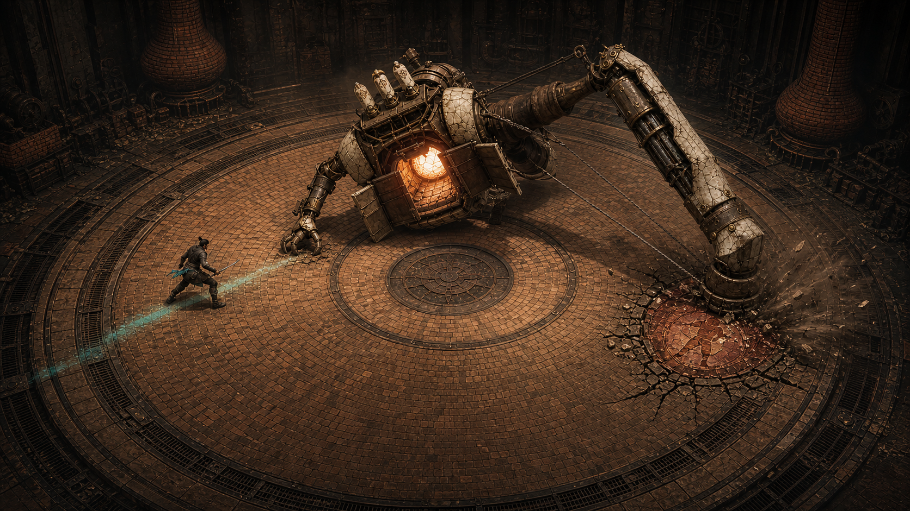
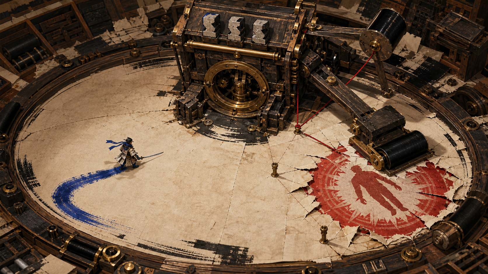
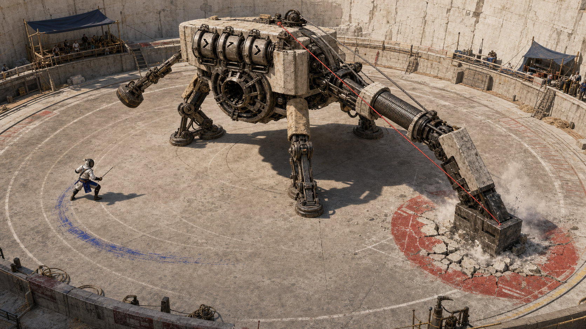

# Mirror Me AI — 미술 방향 20초 검토

공동 디렉터의 최종 선택은 **A. Kiln Reliquary**다. B와 C는 비교 기록으로만 보존한다.

## A. Kiln Reliquary — 우선안

세 장의 도편에 구운 발놀림을 맹신한 소성 기계가 빈곳을 내려쳐 스스로 화구를 여는 산업 제례장 액션 보스전.

## B. Print Tribunal

플레이어의 세 발자국을 납 활자로 조판한 인쇄기가 빈 예측을 압착해 자기 플라이휠 코어를 여는 잉크 법정 보스전.

## C. Counterweight Games

세 선택 드럼을 맞춘 콘크리트 시험기가 빈 측량점에 램을 박고 케이블 장력으로 브레이크 코어를 여는 야외 시험장 보스전.

**결정 완료:** A를 첫 비주얼 수직 슬라이스의 방향으로 잠근다.
